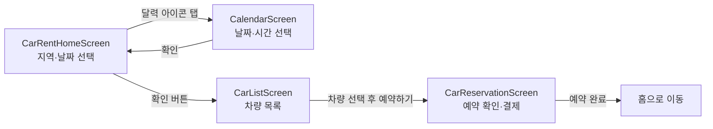
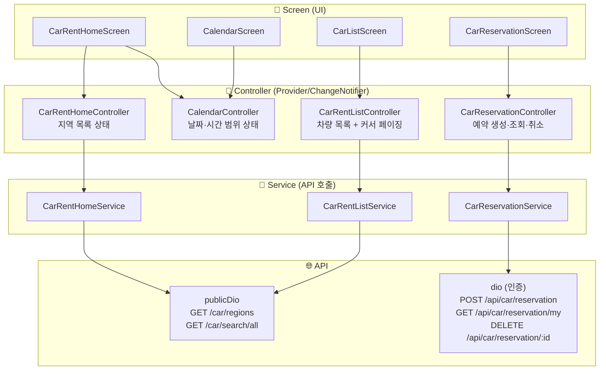
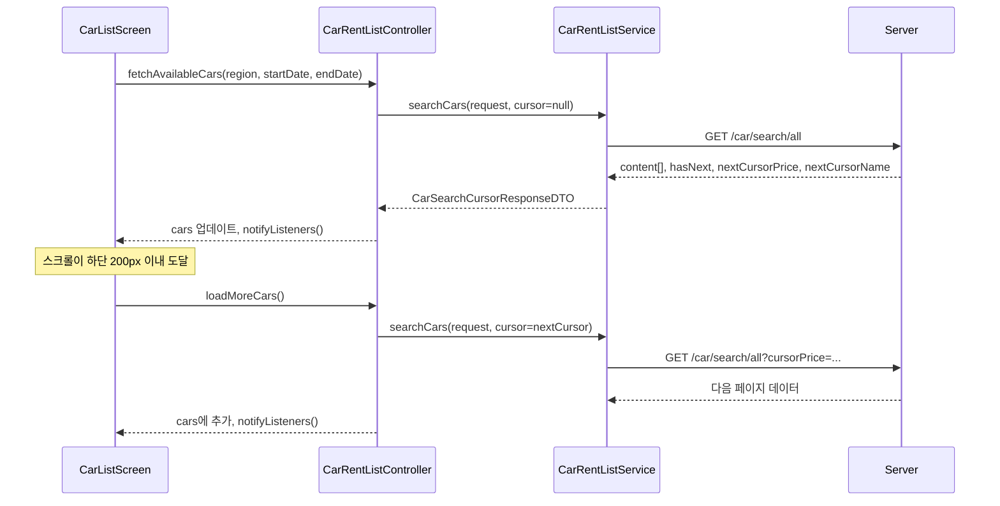
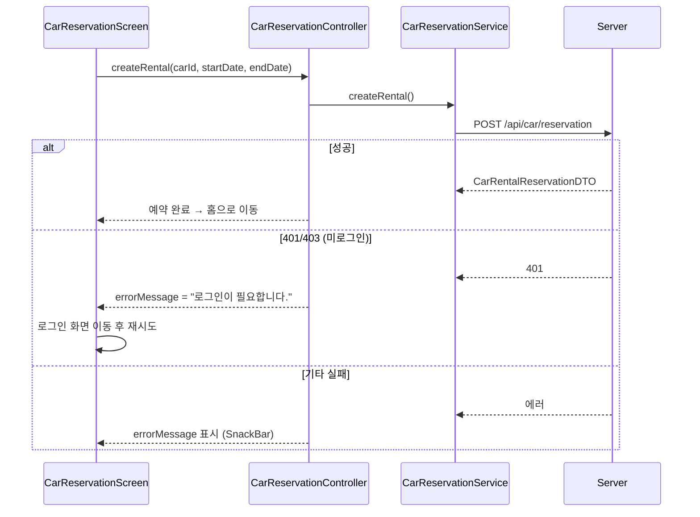
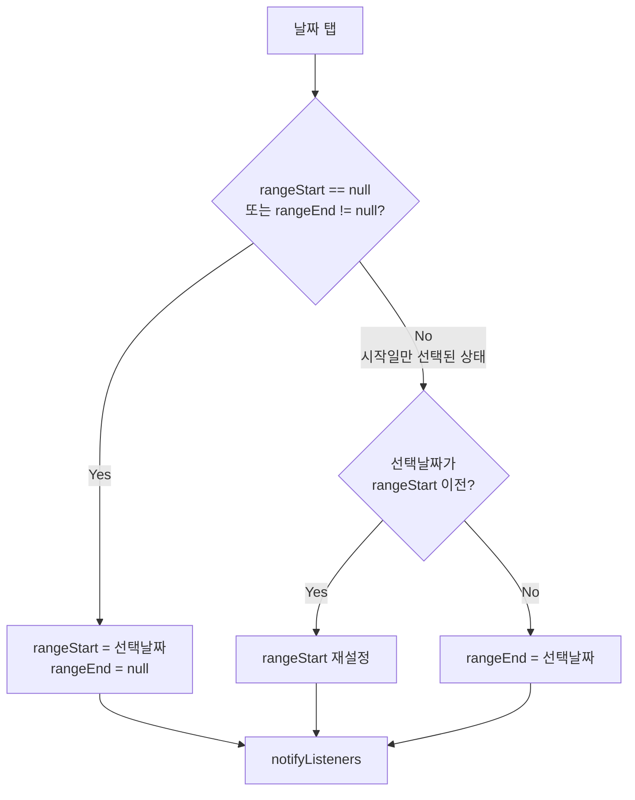

# 🚗 Car (차량 렌트) 기능 문서

## 📱 화면 흐름

---

## 🏗️ 레이어 구조

---

## 📄 커서 페이징 흐름 (차량 목록)

---

## 📝 예약 생성 흐름

---

## 📅 CalendarController 날짜 선택 로직

---

## 🧩 컨트롤러 역할 요약

| 컨트롤러 | 상태 | 주요 메서드 |
|---|---|---|
| `CarRentHomeController` | `regions`, `isLoading` | `fetchRegions()` |
| `CalendarController` | `rangeStart`, `rangeEnd`, `startTime`, `endTime` | `onDaySelected()`, `saveState()`, `restoreState()` |
| `CarRentListController` | `cars[]`, `hasNext`, 커서값 | `fetchAvailableCars()`, `loadMoreCars()` |
| `CarReservationController` | `myRentals[]`, `hasNext`, 커서값 | `createRental()`, `fetchMyRentals()`, `cancelRental()` |

---

## ⚠️ 특이사항

- **CalendarScreen 뒤로가기 취소**
  - `CarRentHomeScreen`에서 `saveState()`로 상태 백업 후 달력 이동
  - 취소 시 `restoreState()`로 이전 상태 복원

- **Shimmer 로딩**
  - 차량 목록 최초 로딩 중: shimmer 카드 10개 표시
  - 추가 로딩(페이징) 중: 리스트 마지막에 shimmer 1개 추가

- **AutomaticKeepAliveClientMixin**
  - 차량 카드의 "더보기" 펼침 상태가 스크롤 시 초기화되는 것을 방지

- **차량 타입별 이미지**
  - `SUV` / `대형` / `중형` / `소형` / `경형` / `승합` 각각 다른 assets 이미지 사용
